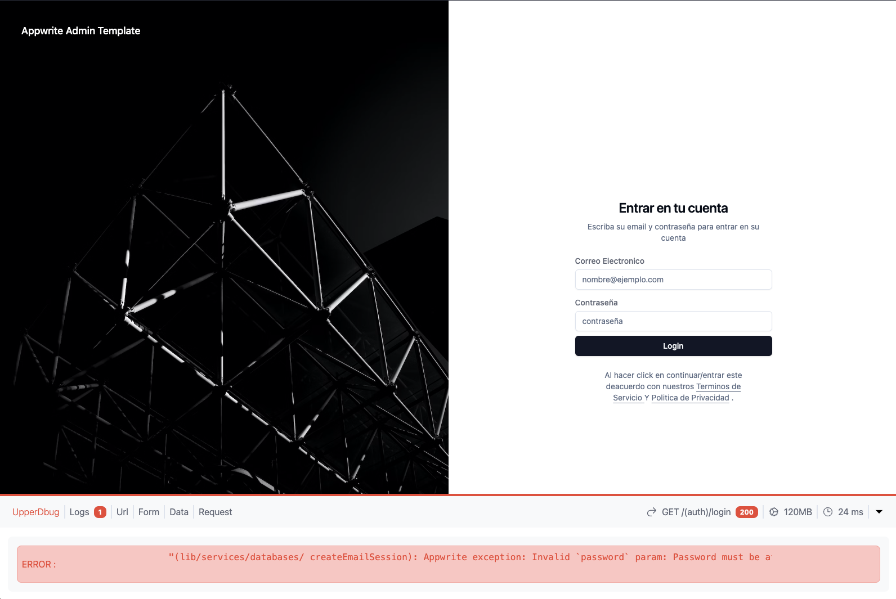
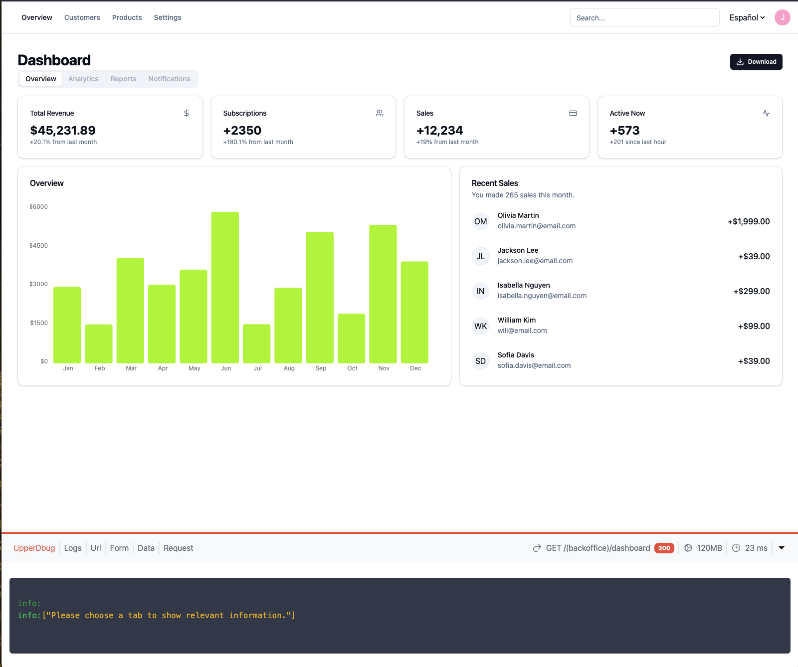
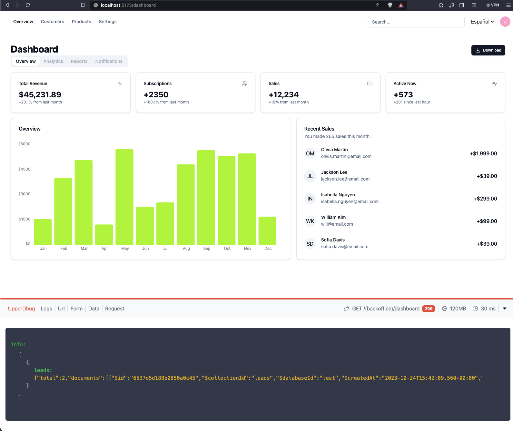

# SvelteKit Appwrite BackOffice Template

Everything you need to build an Administration Panel Using Svelte/SvelteKit and AppWrite

## Screenshots




## Development

If you want to begin the development process, follow this guide.

```bash
# create a new project in the current directory
git clone repo

# cd into directory
cd project-name/

# install dependencies
pnpm i

# create new env file and update the variables
copy .env.example .env

# run the project
pnpm dev
```

## Appwrite
There's an appwrite folder in the root of the project, it contains the base functions, database and collections for the project.

there's also a bash script that can be run with ./login_appwrite.sh, it will promp to login to appwrite instance that you spesify in the .env, see .env.example

## Events
To use the events handler simple follow:

```bash
# import event list
import EVENTS from $lib/common/constants/events
# import dispatchEvent
import dispatchEvent from $lib/common/events/event-bus

# have some payload ready to send
const payload = {
    name: 'demo',
    notifications: {
        email: true,
        sms: true
    }
}

# use the function on the component that you want to trigger the event,
<button on:click={() => dispatchEvent(EVENTS.UPDATE_PROFILE, payload)} >hi</button>

# Add as many more handlers and events as need it

```

## Folder Structure
The project is well organized into the following folder structure, and use route grouping.

### Routes
- (auth) Here you will find a group of route with the auth layout ( Public route )
- (backoffice) Here you will find the admin panel ( Protected route )

### Lib
- common
- - constants All application constants are here, images, sizes, enums, colors, api_constants.
- - formatters Formatter utility class to format numbers into currency, format date etc.
- - local_storage Local Storage utility class
- - logger Logger utility class
- - utils Multiple helpers functions
- - validators Validator utility class for email, phone etc
- data Mock/Fake data
- features Here is where we will put the features for the application
- - authentication
- - dashboard
- localization Language files and localization utility class
- stores All application stores are going to be here
- ui All UI related to the application is going to be here
- - components Here is the component library
- - widgets this are a collection of common ui widgets that combine ui components into functional widgets

## Tech Stack

- SvelteKit
- Svelte
- TailwindCSS
- ShadCN-Svelte
- AppWrite

You can preview the production build with `npm run preview`.

> To deploy your app, you may need to install an [adapter](https://kit.svelte.dev/docs/adapters) for your target environment.
